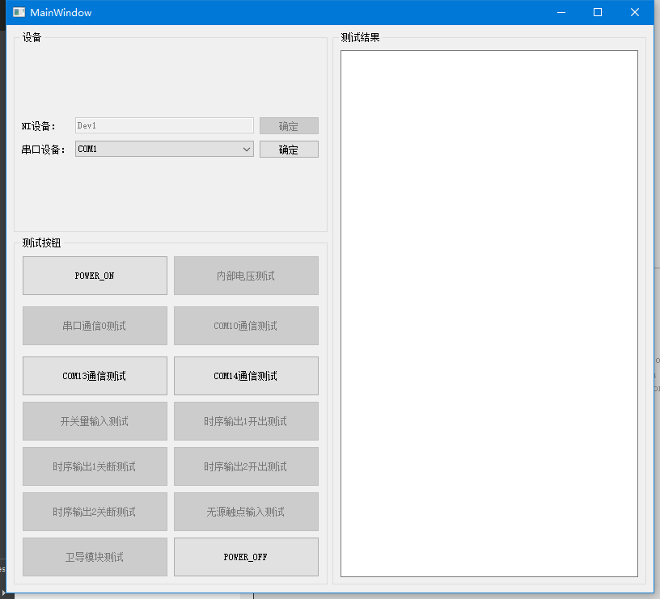

# QT-example
QT-example应用程序

# YOLOV5-Window

## 1.需要下载opencv4.5+
  下载地址：https://opencv.org/releases/
## 2.需要QT动态库，版本5.14.2
  下载地址：https://pan.baidu.com/s/1hP0AUQtyDqOijYXYYUJpWQ 
提取码：22jg
## 3.程序运行截图
   
   

# 综控机测试软件 

  地址：https://github.com/FakeItUtillMakeIt/QT-example/tree/main/GeneralCTrlMacTest

## 1.需要NI设备支持
## 2.需要串口支持
## 3.程序运行截图
   
  
